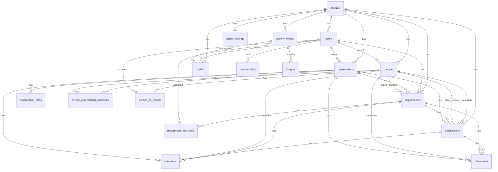
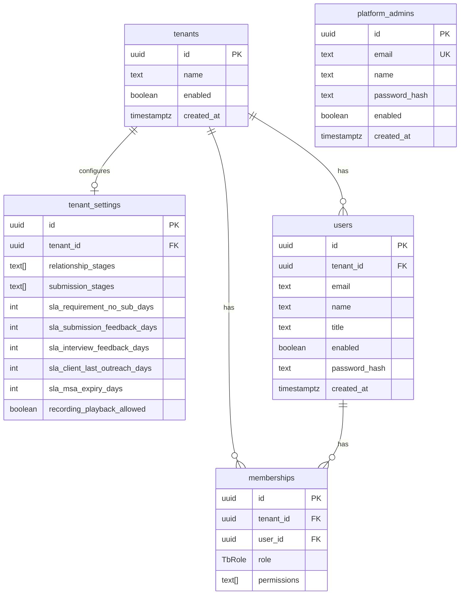
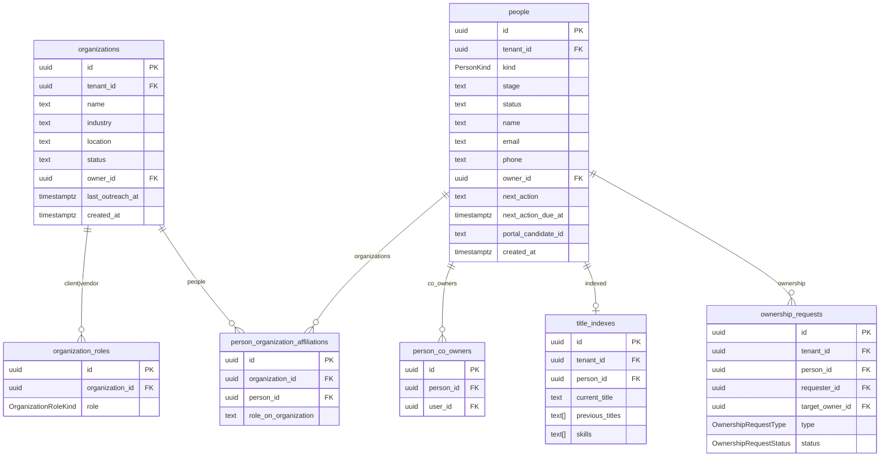
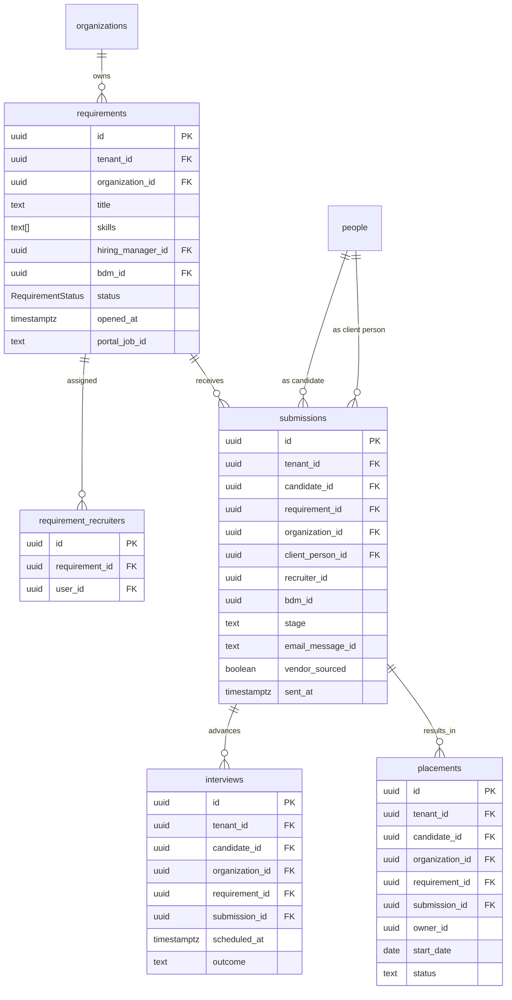
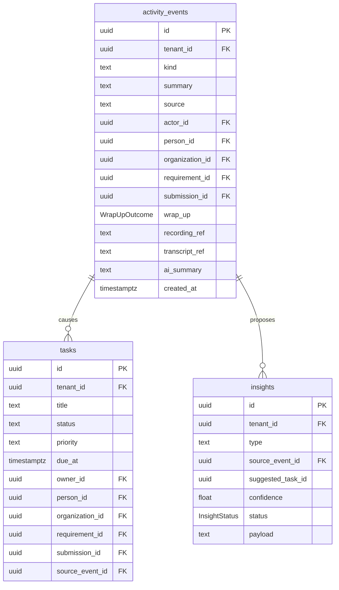
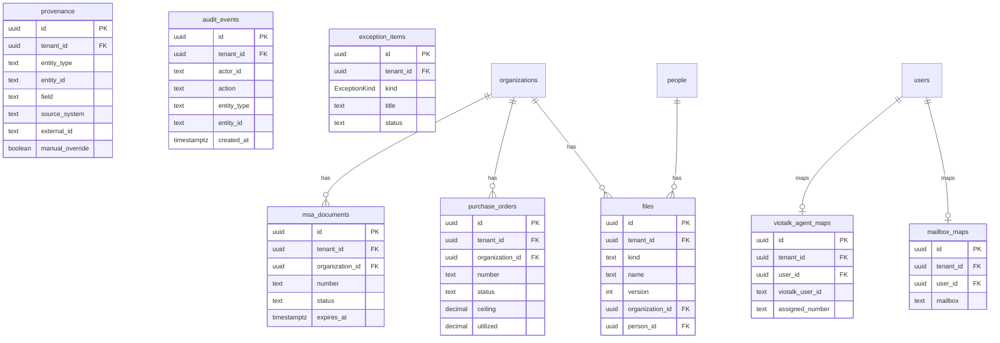

# TalentBridge database schema & ER diagram

Source of truth for the physical model: [`prisma/schema.prisma`](../prisma/schema.prisma).  
PostgreSQL schema name: **`talentbridge`** (created by [`prisma/init.sql`](../prisma/init.sql)).

Vocabulary matches [`talentbridge_contact_management_database_design.md`](talentbridge_contact_management_database_design.md) for people / organizations / activity events / files. Hub-owned work objects (requirements, submissions, interviews, placements) remain in TalentBridge.

This document describes the POC tables, enums, and relationships for the Contact Manager hub (Candidates, Clients, Vendors — with Requirements and Submissions as work objects).

---

## 1. Overview ER diagram

Core operational graph: tenant → people/organizations → requirements → submissions → interviews/placements, plus activity/task wrap-up.

---

## 2. Domain ER diagrams

### 2.1 Identity & tenancy

### 2.2 Organizations (clients / vendors) & people

`PersonKind`: `candidate` | `client_person` | `vendor_person`  
`OrganizationRoleKind`: `client` | `vendor` (same organization can hold both roles)

### 2.3 Requirements, submissions, interviews, placements

Product rule: **Submissions are TalentBridge work objects** (not emails, not JobsNProfiles ATS records). Requirements live on the Client organization — not a fourth left-nav module in POC.

### 2.4 Activity events, tasks, insights (next action)

`WrapUpOutcome`: `next_action` | `no_action_required` | `closed` — every important touch should land in one of these.

### 2.5 Files, commercial, integrations, audit

Prisma model for files table: `StoredFile` (avoids clash with browser `File`).

---

## 3. Table catalog

All tables live in schema `talentbridge`. IDs are UUIDs unless noted.

| Table | Prisma model | Purpose |
|-------|--------------|---------|
| `tenants` | `Tenant` | Workspace / org root (`enabled` gates TalentBridge login) |
| `platform_admins` | `PlatformAdmin` | Global Admins for Admin-Talent-Bridge (no tenant_id) |
| `tenant_settings` | `TenantSettings` | Stages + SLA defaults per tenant |
| `users` | `User` | People who log into the hub |
| `memberships` | `Membership` | Role (`TbRole`) + permissions per user |
| `organizations` | `Organization` | Client / vendor company records |
| `organization_roles` | `OrganizationRole` | `client` and/or `vendor` on an organization |
| `people` | `Person` | Candidates, client people, vendor people |
| `person_co_owners` | `PersonCoOwner` | Collaboration owners on a person |
| `person_organization_affiliations` | `PersonOrganizationAffiliation` | Person ↔ organization link + role |
| `requirements` | `Requirement` | Jobs / reqs on a client organization |
| `requirement_recruiters` | `RequirementRecruiter` | Recruiters assigned to a req |
| `submissions` | `Submission` | Hub submission work object |
| `interviews` | `Interview` | Interview events on a submission/req |
| `placements` | `Placement` | Placement continuity after hire |
| `activity_events` | `ActivityEvent` | Unified timeline events (mail, call, note, …) |
| `tasks` | `Task` | Next actions / follow-ups |
| `insights` | `Insight` | AI-proposed actions (accept / dismiss) |
| `files` | `StoredFile` | Generic docs on organization or person |
| `msa_documents` | `MsaDocument` | MSA tracking on organization |
| `purchase_orders` | `PurchaseOrder` | PO ceiling / utilization |
| `provenance` | `Provenance` | Field-level source system lineage |
| `audit_events` | `AuditEvent` | Mutable-action audit trail |
| `title_indexes` | `TitleIndex` | Candidate title / skills search index |
| `ownership_requests` | `OwnershipRequest` | Collaboration or transfer requests |
| `exception_items` | `ExceptionItem` | Unmatched mail/call, duplicates, sync failures |
| `viotalk_agent_maps` | `VioTalkAgentMap` | User ↔ VioTalk agent / number |
| `mailbox_maps` | `MailboxMap` | User ↔ Outlook mailbox |
| `external_entity_links` | `ExternalEntityLink` | Stable external system ids (e.g. JobsNProfiles candidate) |

---

## 4. Enums

| Enum | Values |
|------|--------|
| `TbRole` | `recruiter`, `sales`, `operations`, `leadership`, `admin` |
| `PersonKind` | `candidate`, `client_person`, `vendor_person` |
| `OrganizationRoleKind` | `client`, `vendor` |
| `RequirementStatus` | `open`, `on_hold`, `filled`, `cancelled` |
| `WrapUpOutcome` | `next_action`, `no_action_required`, `closed` |
| `OwnershipRequestType` | `collaboration`, `transfer` |
| `OwnershipRequestStatus` | `pending`, `accepted`, `dismissed` |
| `ExceptionKind` | `unmatched_mail`, `unmatched_call`, `duplicate`, `failed_sync` |
| `InsightStatus` | `proposed`, `accepted`, `dismissed` |

Configurable stage lists (relationship / submission) live as string arrays on `tenant_settings`, not as Postgres enums.

---

## 5. Key relationships (quick reference)

| From | To | Cardinality | Notes |
|------|----|-------------|-------|
| `Tenant` | almost everything | 1 → N | Soft multi-tenant root |
| `User` | `Person` / `Organization` | 1 → N | Ownership |
| `Organization` | `Requirement` | 1 → N | Jobs on the client |
| `Requirement` | `Submission` | 1 → N | Hub work objects |
| `Person` (candidate) | `Submission` | 1 → N | Who was submitted |
| `Person` (client person) | `Submission` | 1 → N | Who received it |
| `Submission` | `Interview` / `Placement` | 1 → N | Optional FK |
| `ActivityEvent` | `Task` / `Insight` | 1 → N | Wrap-up → next action |
| `User` | `VioTalkAgentMap` / `MailboxMap` | 1 → 0..1 | Channel identity maps |

External systems are **not** cloned into this schema:

- **JobsNProfiles** → inbound candidate/job ids (`portal_candidate_id`, `portal_job_id`); never write client submissions back
- **Outlook** → `mailbox_maps` + activity/email refs
- **VioTalk** → `viotalk_agent_maps` + recording/transcript refs on `activity_events`

---

## 6. Indexes & uniqueness (from Prisma + search SQL)

### Uniqueness

| Constraint | Columns |
|------------|---------|
| Unique | `users (tenant_id, email)` |
| Unique | `memberships (tenant_id, user_id)` |
| Unique | `organization_roles (organization_id, role)` |
| Unique | `person_co_owners (person_id, user_id)` |
| Unique | `person_organization_affiliations (organization_id, person_id)` |
| Unique | `requirement_recruiters (requirement_id, user_id)` |
| Unique | `people.portal_candidate_id` |
| Unique | `title_indexes.person_id` |
| Unique | `viotalk_agent_maps.user_id`, `mailbox_maps.user_id` |
| Unique | `tenant_settings.tenant_id` |

### Hot-path B-tree / GIN (Prisma)

| Index | Why |
|-------|-----|
| `people (tenant_id, kind)` | Module lists |
| `people (tenant_id, email_normalized)` / `(tenant_id, phone_normalized)` | JNP match |
| `people (tenant_id, last_outreach_at)` | Sort + SLA |
| `people (tenant_id, owner_id)` / `(tenant_id, source)` / `(tenant_id, stage)` / `(tenant_id, experience_years)` | Candidate Search filters |
| `people.skills` GIN | Skills containment |
| `organizations (tenant_id, last_outreach_at)` / `(tenant_id, owner_id)` / `(tenant_id, status)` | Client 360 / stale clients |
| `requirements (tenant_id, status)` / `(tenant_id, organization_id, status)` / `(tenant_id, opened_at)` | Open jobs + aging |
| `requirements.skills` GIN | Skill overlap |
| `submissions (tenant_id, stage)` / `(tenant_id, requirement_id)` / `(tenant_id, candidate_id)` / `(tenant_id, organization_id, stage)` / `(tenant_id, sent_at)` | Pipeline + exclude-submitted |
| `interviews (tenant_id, outcome, scheduled_at)` | Feedback SLA |
| `activity_events (tenant_id, created_at)` / `(tenant_id, wrap_up, created_at)` / person+org timelines | Timeline + inbox |
| `tasks (tenant_id, status, due_at)` / owner+person variants | Task inbox |
| `title_indexes` GIN on `skills`, `previous_titles`, `resume_titles` | Title/skills discovery |
| `files (tenant_id, person_id)` / `(tenant_id, organization_id)` | Record files |
| `msa_documents (tenant_id, expires_at)` | MSA risk |
| `purchase_orders (tenant_id, status)` | PO risk |
| `exception_items (tenant_id, status, created_at)` | Exception queue |
| `provenance` / `audit_events` | Lineage + audit |

### Text trigram + partial (apply [`prisma/sql/search_indexes.sql`](../prisma/sql/search_indexes.sql))

Requires `CREATE EXTENSION pg_trgm` (also in [`prisma/init.sql`](../prisma/init.sql)).

| Index | Why |
|-------|-----|
| GIN trgm on `people.name` / `title` / `email` / `location` | `ILIKE '%…%'` Candidate + global search |
| GIN trgm on `organizations.name`, `files.name`, `activity_events.summary`, `title_indexes.current_title` | Global / title search |
| Partial `activity_events (tenant_id, created_at) WHERE wrap_up IS NULL` | Communications inbox |
| Partial `requirements (tenant_id, opened_at) WHERE status = 'open'` | Aging open reqs |

---

## 7. How to keep this doc in sync

1. Change models in `prisma/schema.prisma`
2. Run migrations / `db push` as usual
3. Update this file’s diagrams / catalog when tables, enums, or FKs change

Render Mermaid in GitHub, VS Code Markdown preview, or [mermaid.live](https://mermaid.live).

---

## 8. Adoption from contact-design reference

Selective ideas from [`talentbridge_contact_management_database_design.md`](talentbridge_contact_management_database_design.md).  
**Do not** adopt that doc’s boundary that pushes Requirements/Submissions/Interviews/Placements to JobsNProfiles.

### Soon (in schema / product now)

| Item | Status |
|------|--------|
| Channel DNC (`do_not_email`, `do_not_sms` + master `do_not_reach`) | Done on `people` |
| Normalized match fields (`email_normalized`, `phone_normalized`) | Done on `people` |
| JNP match cascade: portal ID → normalized email → normalized phone → human confirm; never auto-merge | Done in `syncJnp` |
| `external_entity_links` for stable cross-system IDs | Done (`ExternalEntityLink`) |
| Resume as resource/label only — not file content or public URL | Product rule (`last_resume` comment) |
| Hub stays up when JNP is down; collisions → `exception_items` | Existing product rule |
| Internal `users` are not CRM `people` | Keep |

### Later (P1+)

| Item | Notes |
|------|--------|
| Multiple `contact_methods` | When one email/phone is not enough |
| Time-bound affiliations (employment / vendor / C2C) | Enrich `person_organization_affiliations`; never use client affiliation as submission |
| Client tier / health / strategic flags | On `organizations` for relationship intelligence |
| Preferred contact method/time, influence level | Client-person relationship fields |
| Typed call detail extension | Keep `activity_events` as timeline; optional detail when VioTalk needs more |
| Tags | Discovery aid, not P0 |

### Never (for this product)

- Moving Requirements / Submissions / Interviews / Placements out of TalentBridge
- Replacing wrap-up `activity_events` + `tasks` with a CRM-only communications stack
- Splitting POC into many profile tables (`candidate_profiles`, etc.) before product need
