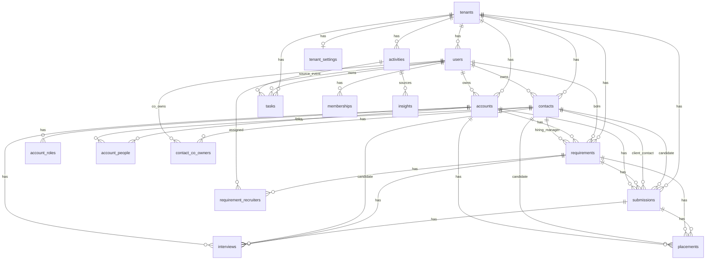
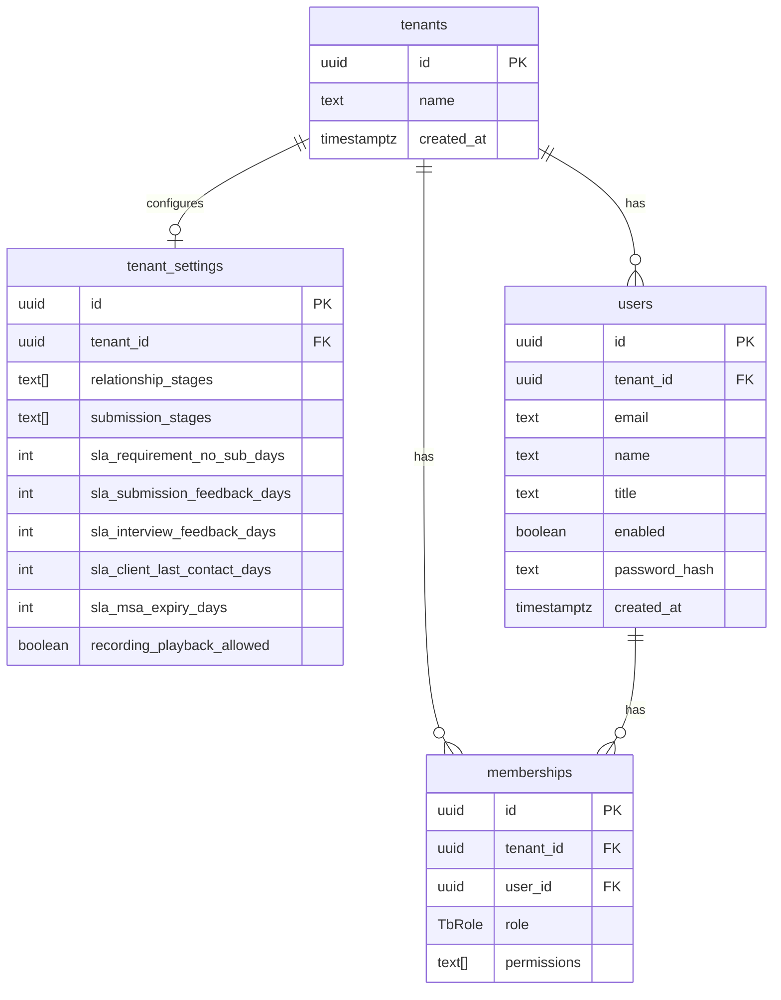
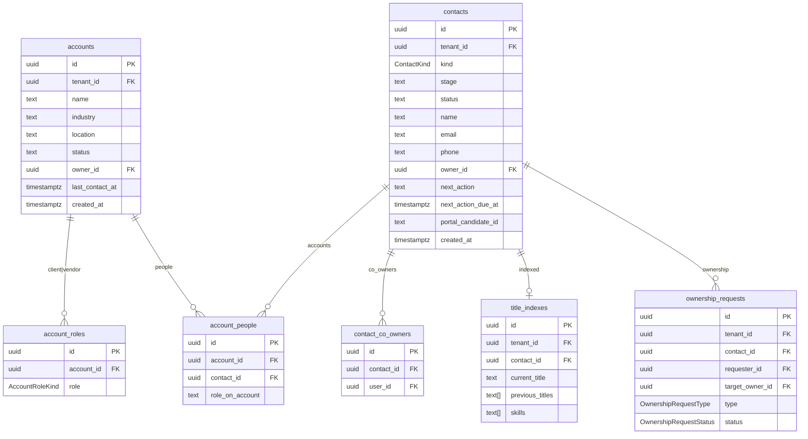
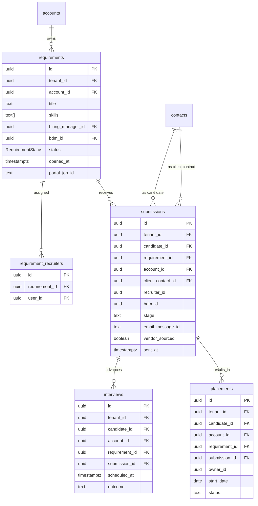
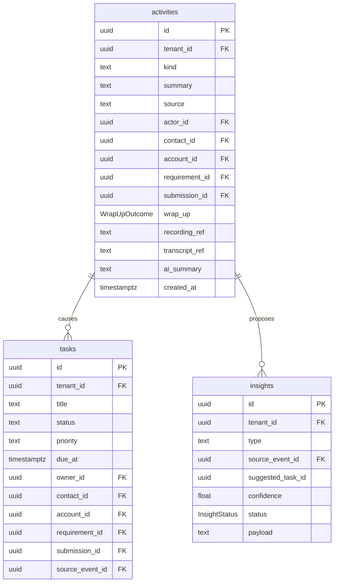
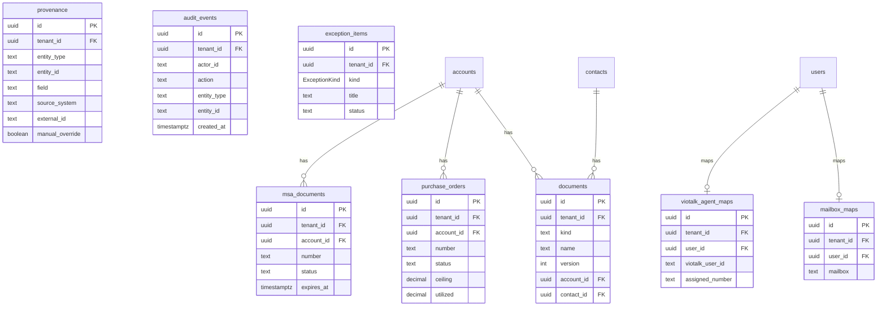

# TalentBridge database schema & ER diagram

Source of truth for the physical model: [`prisma/schema.prisma`](../prisma/schema.prisma).  
PostgreSQL schema name: **`talentbridge`** (created by [`prisma/init.sql`](../prisma/init.sql)).

This document describes the POC tables, enums, and relationships for the Contact Manager hub (Candidates, Clients, Vendors — with Requirements and Submissions as work objects).

---

## 1. Overview ER diagram

Core operational graph: tenant → people/accounts → requirements → submissions → interviews/placements, plus activity/task wrap-up.

---

## 2. Domain ER diagrams

### 2.1 Identity & tenancy

### 2.2 Accounts (clients / vendors) & contacts

`Contact.kind`: `candidate` | `client_person` | `vendor_person`  
`AccountRole.role`: `client` | `vendor` (same account can hold both roles)

### 2.3 Requirements, submissions, interviews, placements

Product rule: **Submissions are TalentBridge work objects** (not emails, not JobsNProfiles ATS records). Requirements live on the Client account — not a fourth left-nav module in POC.

### 2.4 Activity, tasks, insights (next action)

`WrapUpOutcome`: `next_action` | `no_action_required` | `closed` — every important touch should land in one of these.

### 2.5 Documents, commercial, integrations, audit

---

## 3. Table catalog

All tables live in schema `talentbridge`. IDs are UUIDs unless noted.

| Table | Purpose |
|-------|---------|
| `tenants` | Workspace / org root |
| `tenant_settings` | Stages + SLA defaults per tenant |
| `users` | People who log into the hub |
| `memberships` | Role (`TbRole`) + permissions per user |
| `accounts` | Client / vendor company records |
| `account_roles` | `client` and/or `vendor` on an account |
| `contacts` | Candidates, client people, vendor people |
| `contact_co_owners` | Collaboration owners on a contact |
| `account_people` | Contact ↔ account link + role on account |
| `requirements` | Jobs / reqs on a client account |
| `requirement_recruiters` | Recruiters assigned to a req |
| `submissions` | Hub submission work object |
| `interviews` | Interview events on a submission/req |
| `placements` | Placement continuity after hire |
| `activities` | Unified timeline events (mail, call, note, …) |
| `tasks` | Next actions / follow-ups |
| `insights` | AI-proposed actions (accept / dismiss) |
| `documents` | Generic docs on account or contact |
| `msa_documents` | MSA tracking on account |
| `purchase_orders` | PO ceiling / utilization |
| `provenance` | Field-level source system lineage |
| `audit_events` | Mutable-action audit trail |
| `title_indexes` | Candidate title / skills search index |
| `ownership_requests` | Collaboration or transfer requests |
| `exception_items` | Unmatched mail/call, duplicates, sync failures |
| `viotalk_agent_maps` | User ↔ VioTalk agent / number |
| `mailbox_maps` | User ↔ Outlook mailbox |
| `external_entity_links` | Stable external system ids (e.g. JobsNProfiles candidate) |

---

## 4. Enums

| Enum | Values |
|------|--------|
| `TbRole` | `recruiter`, `sales`, `operations`, `leadership`, `admin` |
| `ContactKind` | `candidate`, `client_person`, `vendor_person` |
| `AccountRoleKind` | `client`, `vendor` |
| `RequirementStatus` | `open`, `on_hold`, `filled`, `cancelled` |
| `WrapUpOutcome` | `next_action`, `no_action_required`, `closed` |
| `OwnershipRequestType` | `collaboration`, `transfer` |
| `OwnershipRequestStatus` | `pending`, `accepted`, `dismissed` |
| `ExceptionKind` | `unmatched_mail`, `unmatched_call`, `duplicate`, `failed_sync` |
| `InsightStatus` | `proposed`, `accepted`, `dismissed` |

Configurable stage lists (relationship / submission) live as string arrays on `tenant_settings`, not as Postgres enums.

---

## 5. Key relationships (quick reference)

| From | To | Cardinality | Notes |
|------|----|-------------|-------|
| `Tenant` | almost everything | 1 → N | Soft multi-tenant root |
| `User` | `Contact` / `Account` | 1 → N | Ownership |
| `Account` | `Requirement` | 1 → N | Jobs on the client |
| `Requirement` | `Submission` | 1 → N | Hub work objects |
| `Contact` (candidate) | `Submission` | 1 → N | Who was submitted |
| `Contact` (client person) | `Submission` | 1 → N | Who received it |
| `Submission` | `Interview` / `Placement` | 1 → N | Optional FK |
| `Activity` | `Task` / `Insight` | 1 → N | Wrap-up → next action |
| `User` | `VioTalkAgentMap` / `MailboxMap` | 1 → 0..1 | Channel identity maps |

External systems are **not** cloned into this schema:

- **JobsNProfiles** → inbound candidate/job ids (`portal_candidate_id`, `portal_job_id`); never write client submissions back
- **Outlook** → `mailbox_maps` + activity/email refs
- **VioTalk** → `viotalk_agent_maps` + recording/transcript refs on `activities`

---

## 6. Indexes & uniqueness (from Prisma)

| Constraint | Columns |
|------------|---------|
| Unique | `users (tenant_id, email)` |
| Unique | `memberships (tenant_id, user_id)` |
| Unique | `account_roles (account_id, role)` |
| Unique | `contact_co_owners (contact_id, user_id)` |
| Unique | `account_people (account_id, contact_id)` |
| Unique | `requirement_recruiters (requirement_id, user_id)` |
| Unique | `contacts.portal_candidate_id` |
| Unique | `title_indexes.contact_id` |
| Unique | `viotalk_agent_maps.user_id`, `mailbox_maps.user_id` |
| Unique | `tenant_settings.tenant_id` |
| Index | `contacts (tenant_id, kind)` |
| Index | `requirements (tenant_id, status)` |
| Index | `submissions (tenant_id, stage)` |
| Index | `activities (tenant_id, created_at)` |
| Index | `tasks (tenant_id, status, due_at)` |
| Index | `provenance (tenant_id, entity_type, entity_id)` |
| Index | `audit_events (tenant_id, created_at)` |

---

## 7. How to keep this doc in sync

1. Change models in `prisma/schema.prisma`
2. Run migrations as usual
3. Update this file’s diagrams / catalog when tables, enums, or FKs change

Render Mermaid in GitHub, VS Code Markdown preview, or [mermaid.live](https://mermaid.live).

---

## 8. Adoption from contact-design reference

Selective ideas from [`talentbridge_contact_management_database_design.md`](talentbridge_contact_management_database_design.md).  
**Do not** adopt that doc’s boundary that pushes Requirements/Submissions/Interviews/Placements to JobsNProfiles.

### Soon (in schema / product now)

| Item | Status |
|------|--------|
| Channel DNC (`do_not_email`, `do_not_sms` + master `do_not_contact`) | Done on `contacts` |
| Normalized match fields (`email_normalized`, `phone_normalized`) | Done on `contacts` |
| JNP match cascade: portal ID → normalized email → normalized phone → human confirm; never auto-merge | Done in `syncJnp` |
| `external_entity_links` for stable cross-system IDs | Done (`ExternalEntityLink`) |
| Resume as resource/label only — not file content or public URL | Product rule (`last_resume` comment) |
| Hub stays up when JNP is down; collisions → `exception_items` | Existing product rule |
| Internal `users` are not CRM `contacts` | Keep |

### Later (P1+)

| Item | Notes |
|------|--------|
| Multiple `contact_methods` | When one email/phone is not enough |
| Time-bound affiliations (employment / vendor / C2C) | Enrich `account_people`; never use client affiliation as submission |
| Client tier / health / strategic flags | On `accounts` for relationship intelligence |
| Preferred contact method/time, influence level | Client-person relationship fields |
| Typed call detail extension | Keep `activities` as timeline; optional detail when VioTalk needs more |
| Tags | Discovery aid, not P0 |

### Never (for this product)

- Moving Requirements / Submissions / Interviews / Placements out of TalentBridge
- Replacing wrap-up `activities` + `tasks` with a CRM-only communications stack
- Rewriting to `people` + many profile tables for POC