# B. Complete flow (visual)

The sample screen is the foundation layout. The diagrams that follow are the product flows developers should implement against that layout, with core modules unchanged (Candidates, Clients, Vendors), plus Submission objects, hub-first Outlook, relationship protection and action intelligence. Jobs live on the Client.

## B.1 Sample workspace (foundation UI)

Three panes: left navigation, middle list, right working profile. Keep this stay-on-page model. Core modules do not change: Candidates, Clients, Vendors. Change action labels so they launch live channels (VioTalk, Outlook compose, WhatsApp) instead of blank log forms. Jobs/Requirements are work objects on the Client and are selected at Submit Profile — they are not a fourth core module.

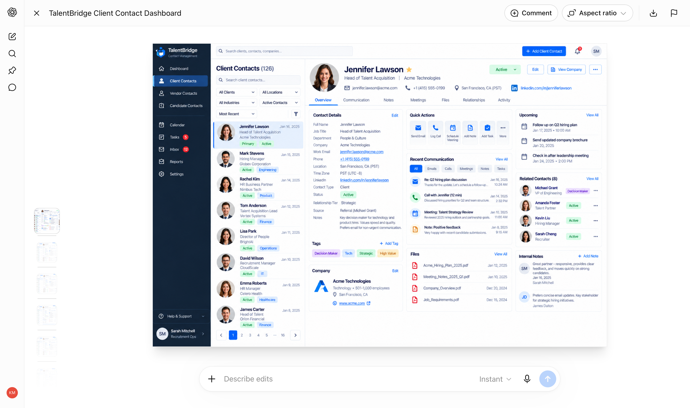

*Figure 0. Sample TalentBridge workspace used as the visual foundation (Jennifer Lawson / Acme Technologies).*

## B.2 Hub architecture

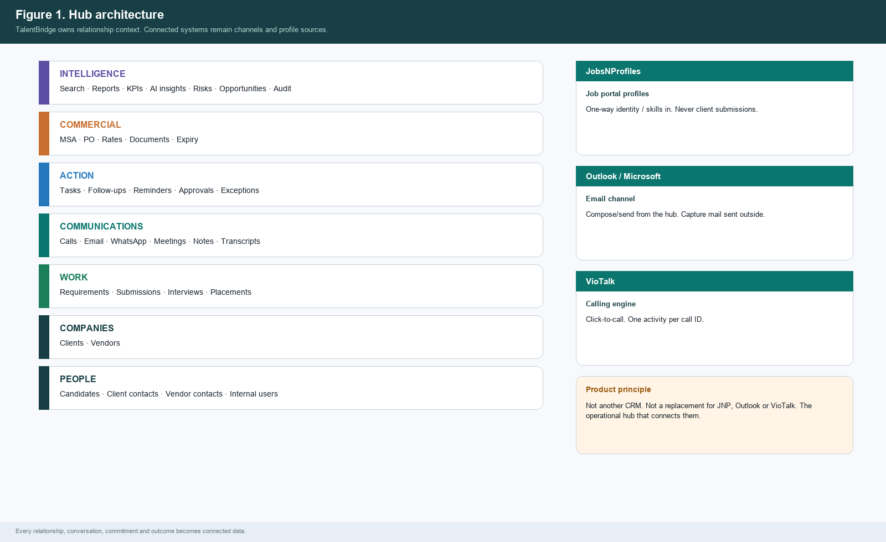

*Figure 1. Hub architecture — TalentBridge layers and connected systems.*

## B.3 Staffing lifecycle

A submission without a requirement cannot answer “for which job?” Submission is a business object with an ID and a lifecycle, evidenced by email, not equal to an email.

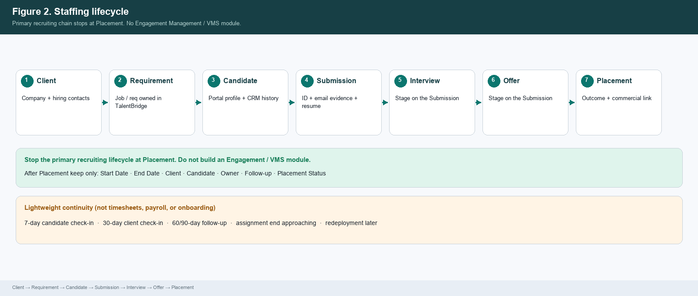

*Figure 2. Staffing lifecycle and Submission ID links.*

## B.4 Operating model

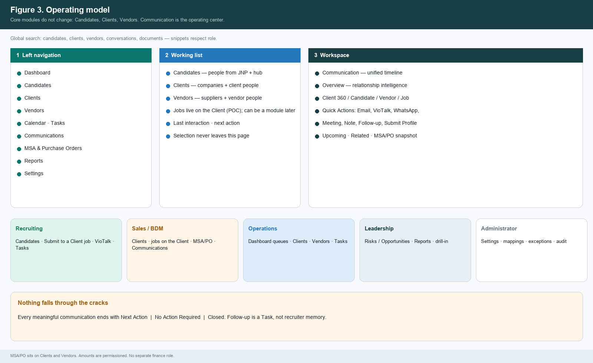

*Figure 3. Operating model — three-pane workspace, roles, wrap-up rule.*

## B.5 Recruiter / delivery journey

1. Land on the Candidates module.
2. Find the person; read JobsNProfiles profile context (one-way sync).
3. If already owned, show the protection banner (owner, last contact, active requirement, recent activity) with Request Collaboration and Request Transfer. Do not auto-merge.
4. VioTalk Call on the assigned number; profile stays visible; disposition required.
5. Wrap-up: Next Action, No Action Required, or Closed.
6. Submit Profile: select Requirement, client contact, attach resume, compose in the hub, send through Outlook.
7. Submission ID writes to candidate, requirement and client. Client reply can move stage. Continue to the next list card; filters survive.

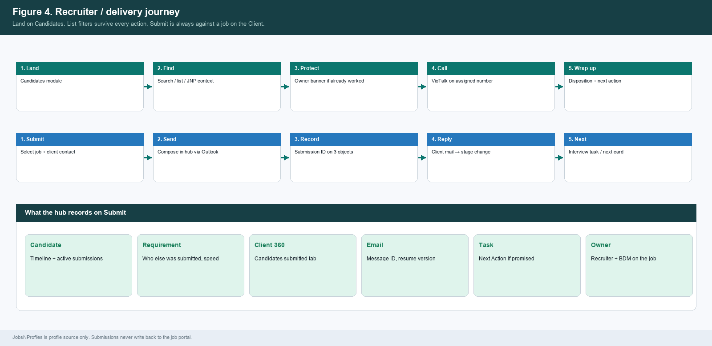

*Figure 4. Recruiter / delivery journey including Submit against a Requirement.*

## B.6 Sales / BDM journey

1. Create or import the Client in TalentBridge (not from JobsNProfiles).
2. Stage Lead → Suspect → Prospect → Customer is permissioned (owner, sales/ops/admin). Stage change does not wipe history. Customer is the won stage; the module remains Clients.
3. Open a Requirement on the Client (hiring manager, skills, BDM, assigned recruiters).
4. Engage from Quick Actions. Review Client 360 including MSA/PO snapshot.

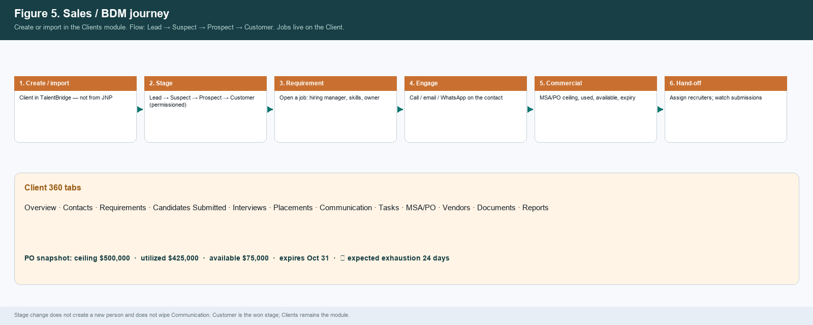

*Figure 5. Sales / BDM journey and Client 360 tabs.*

## B.7 Operations and leadership

Dashboard leads with Today’s Risks and Today’s Opportunities (rule-based in POC). Activity KPIs are the second block. Every tile click-throughs to the live record. Operations works the queue; leadership sees the same objects as risk.

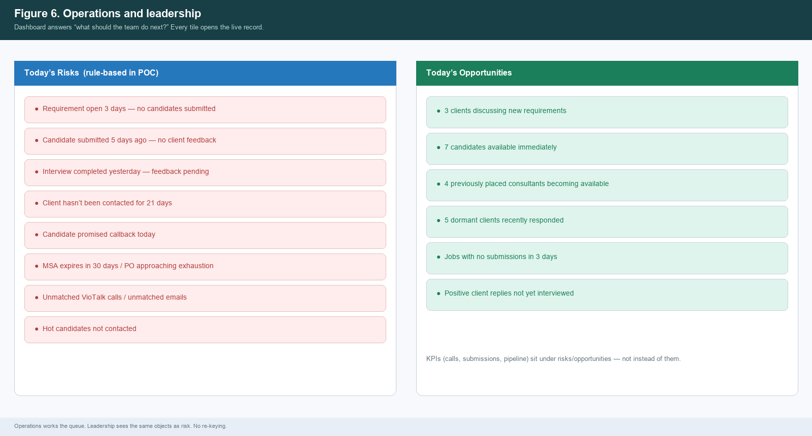

*Figure 6. Dashboard action intelligence — risks and opportunities.*

## B.8 Submit Profile — Outlook hub-first and outside capture

Preferred path: compose and send from TalentBridge through the signed-in user’s Outlook account. Parallel path: Microsoft Graph watches sent and inbound mail and associates it. No TalentBridge template catalog. Unmatched mail goes to a review queue.

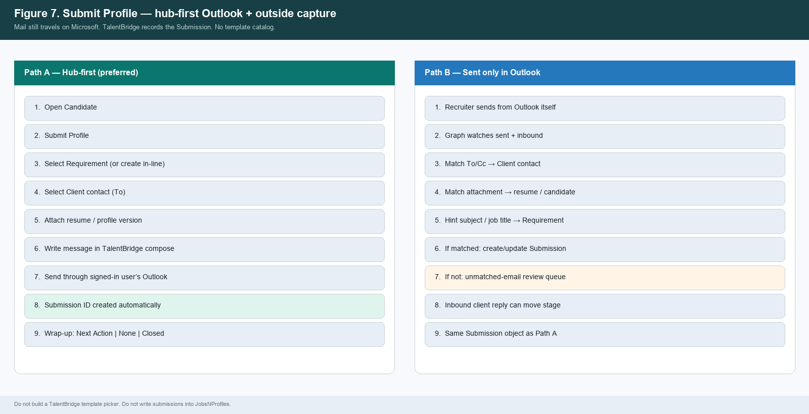

*Figure 7. Hub-first send and outside-Outlook capture — same Submission object.*

## B.9 Unified timeline

Communication is the system of record for authorized internal users. The timeline shows what was said and what it caused, on the person, company, requirement and submission.

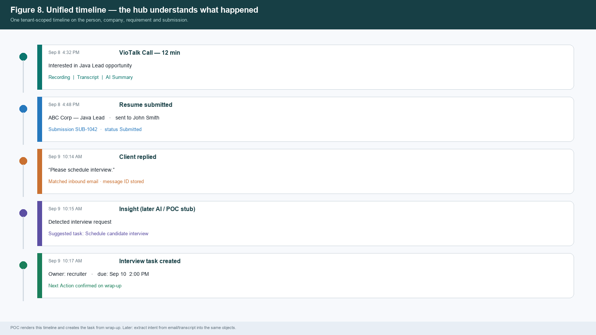

*Figure 8. Example unified timeline from call to interview task.*

## B.10 VioTalk

TalentBridge sends contact ID + phone + signed-in user. VioTalk places the call on the assigned number. One activity keyed by VioTalk call ID. Recording / transcript / AI summary when permitted. Proposed follow-up becomes a Task after wrap-up. Not every TalentBridge role needs a VioTalk seat.

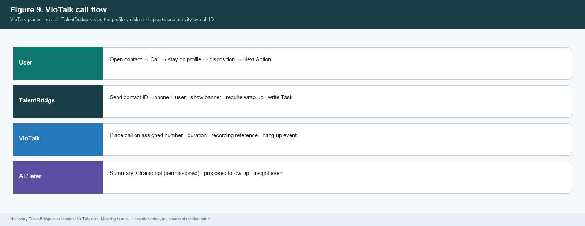

*Figure 9. VioTalk swimlane.*

## B.11 Candidate sync and ownership

One-way: JobsNProfiles portal profile → upsert TalentBridge Candidate by portal candidate ID. Email/phone collisions go to duplicate review with an ownership banner. Never auto-merge. Never push TalentBridge contacts into JobsNProfiles.

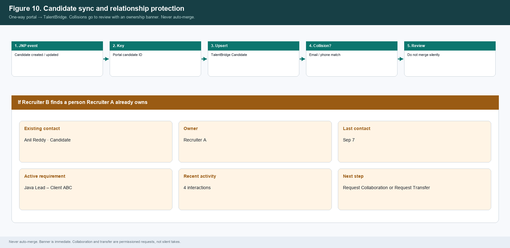

*Figure 10. Sync flow and relationship-protection banner.*

## B.12 Nothing falls through the cracks

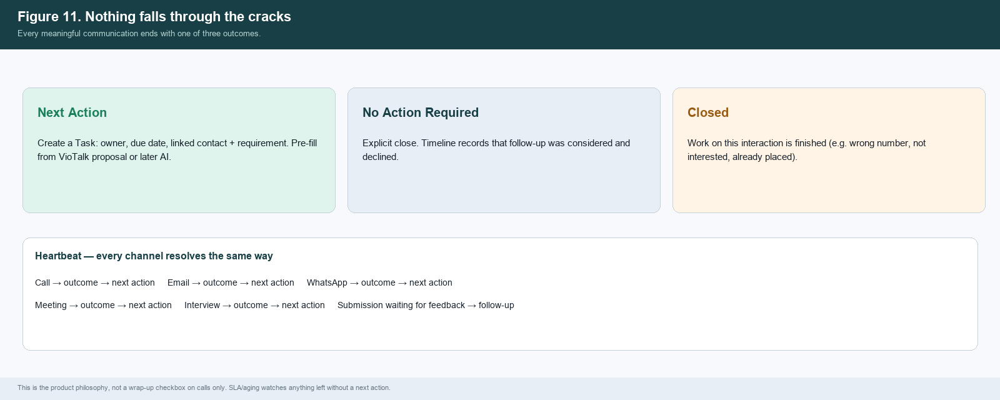

*Figure 11. Required wrap-up outcomes and example task extraction.*

## B.13 Client 360 and Vendor

Opening a Client shows the whole relationship. Overview intelligence: Relationship Owner, Last Contact, Next Action, Open Requirements, Submissions, Interviews, Placements, Average Client Response Time, Requirement Aging, Relationship Health, MSA Status, PO Risk, Recent Commitments. Vendor remains a major module (contacts, candidates, submissions, agreements, rates, compliance) with performance metrics later.

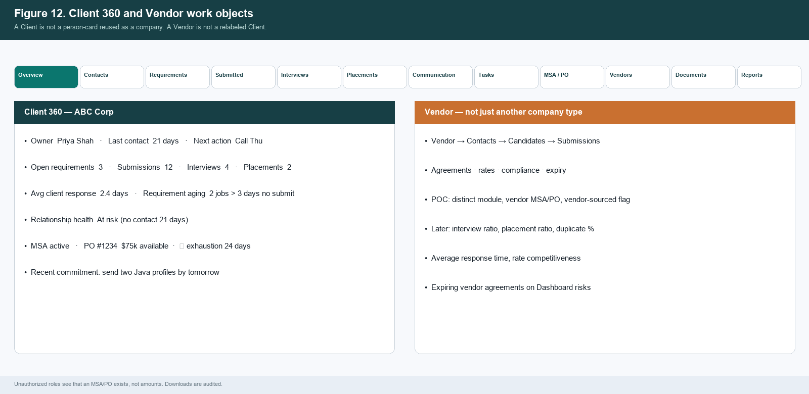

*Figure 12. Client 360 tabs and Vendor work objects.*

## B.14 MSA and purchase orders

Tenant Client and Vendor MSA/POs created in TalentBridge by sales and operations. Not JobsNProfiles MSAs. Not a finance module. Queue: pending review, notice window, low remaining value, exhausted, expected exhaustion.

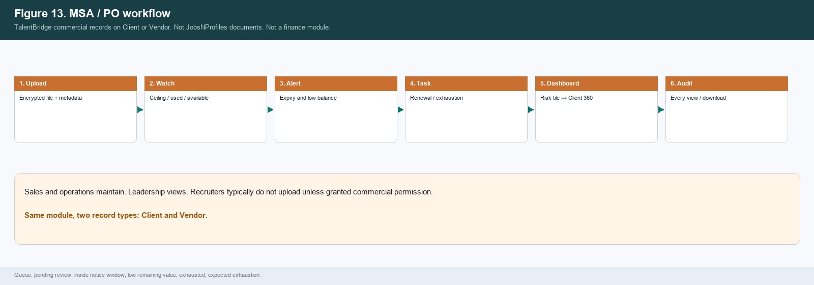

*Figure 13. MSA/PO workflow.*

## B.15 Search and stay-on-page

Two search surfaces. (1) Global search is a jump-to-record bar. Groups, omit empty: Candidates, Clients, Vendors, Conversations, Documents. Jobs and submissions open on the Client or Candidate they belong to. (2) Candidate Search & Discovery lives on the Candidates module — that is the recruiter sourcing workflow and is specified in C.15. Natural-language operational search is later (C.16). Snippets never leak PO amounts, recordings or internal-note bodies.

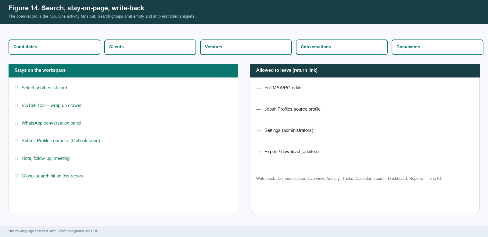

*Figure 14. Search groups and stay-on-page map.*

## B.15a Candidate discovery surface

The Candidates list is not only a directory. It is the discovery surface: filters first (POC), related titles next (MVP), semantic queries later — all on one title/skills/submission index.

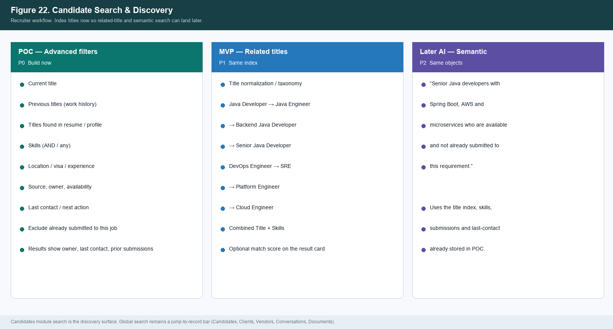

*Figure 22. Candidate Search & Discovery — POC filters, MVP related titles, later semantic search.*

## B.16 Administrator and privacy

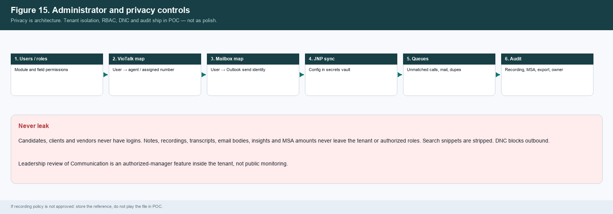

*Figure 15. Admin mapping, exception queues, audit and privacy controls.*

## B.17 Demonstration spine

POC demo must prove the hub in one sitting, not five disconnected integration demos.

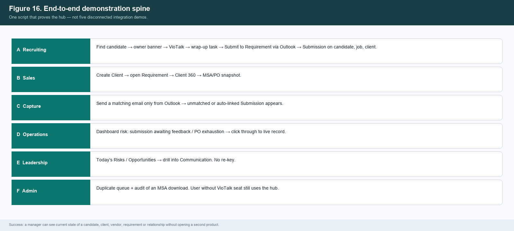

*Figure 16. End-to-end demonstration spine.*

## B.18 Candidate 360

Give candidates the same operational depth as Client 360. Header: Owner, Last Contact, Next Action, Current Status, Active Requirements, Submissions, Interviews, Source (JobsNProfiles), Last Resume.

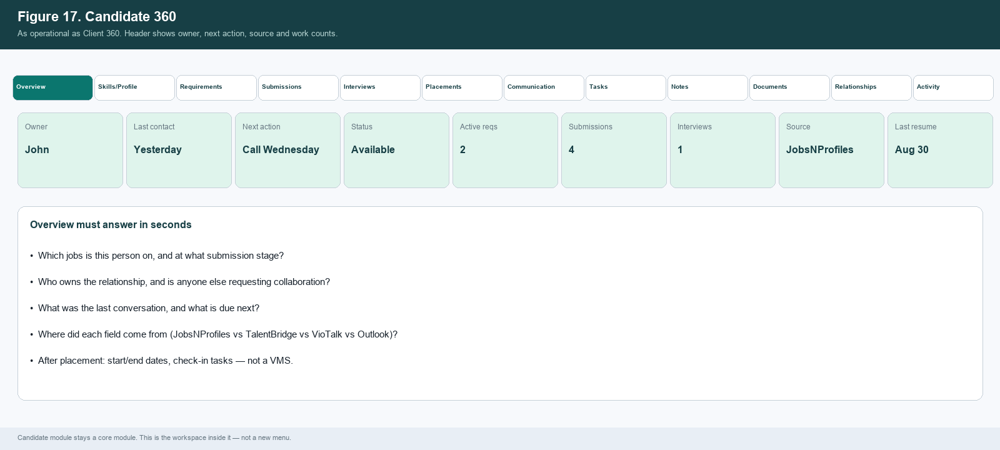

*Figure 17. Candidate 360 workspace.*

## B.19 Data provenance

Because TalentBridge is not the master of every field, every value must carry source_system, external_id, source_timestamp, last_synced_at, sync_status, updated_by and manual_override.

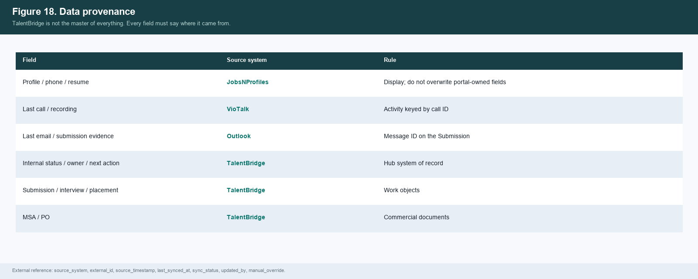

*Figure 18. Field-level provenance.*

## B.20 Product boundary

Keep this boundary explicit so development does not accidentally rebuild JNP, VioTalk, Outlook or a VMS.

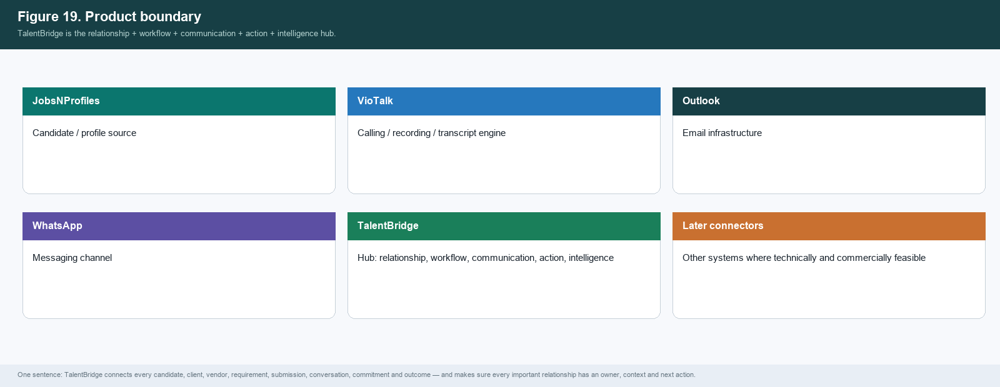

*Figure 19. Product boundary.*

## B.21 Requirements — module-ready later

POC keeps jobs on the Client. Recruiter day-start is often “which requirements need candidates today?” Preserve that flexibility in the object model and filters.

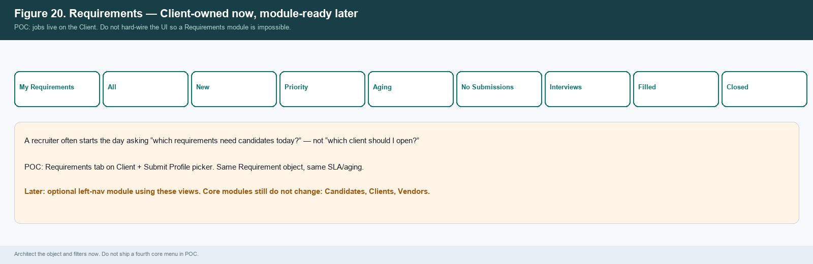

*Figure 20. Requirements views for a later module.*
